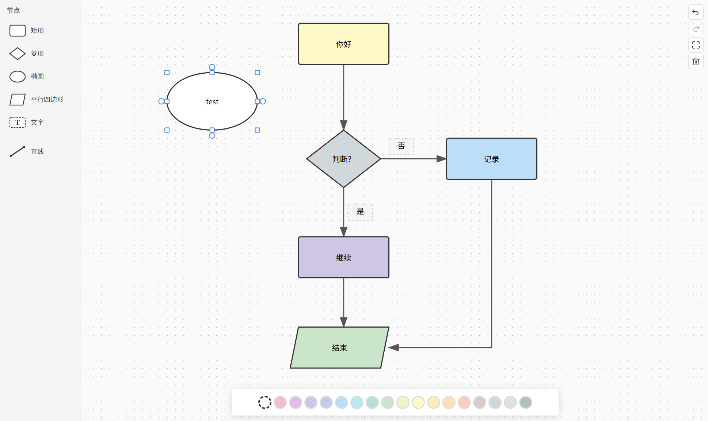

# xiaodao-flowchart

> A pure front-end, interactive flowchart editor component built with **Vue 3 + TypeScript + Vite**.

`xiaodao-flowchart` is a self-contained Vue 3 component for drawing flowcharts directly in the browser. It ships a full editing experience, multiple node shapes, smart orthogonal edge routing, pan/zoom canvas, inline text editing, undo/redo, theming, and i18n, while staying data-driven through a single `v-model` source of truth.



---

## Table of Contents

- [Features](#features)
- [Tech Stack](#tech-stack)
- [Installation](#installation)
- [Scripts](#scripts)
- [Usage](#usage)
- [Props](#props)
- [Events](#events)
- [Data Structures](#data-structures)
- [Project Structure](#project-structure)
- [Interaction Guide](#interaction-guide)
- [Edge Routing Algorithm](#edge-routing-algorithm)
- [Theme Customization](#theme-customization)
- [Internationalization](#internationalization)
- [Keyboard Shortcuts](#keyboard-shortcuts)
- [Browser Compatibility](#browser-compatibility)
- [License](#license)

---

## Features

- **5 node types**: Rectangle, diamond, ellipse, parallelogram, and free-text nodes. All support drag, resize, inline label editing, and custom styling.
- **Smart orthogonal edges**: Automatic orthogonal path routing with multi-segment polylines, node self-avoidance, and third-party node detour.
- **Draggable edge handles**: Selected edges display draggable source/target endpoint handles for reconnecting to other nodes (re-routing).
- **Free lines**: Draw standalone connector lines on the canvas (independent of nodes), with selectable/movable endpoints.
- **Canvas controls**: Mouse-wheel zoom (0.1× – 10×), right/middle-click pan, and an adaptive multi-level dot grid.
- **Node sidebar**: Drag node templates from the sidebar onto the canvas to create nodes. Responsive layout (auto-collapses on mobile).
- **8-way resize**: 8 resize handles appear on selected nodes, with aspect-ratio constraints and minimum-size enforcement.
- **Inline text editing**: Double-click a node to enter edit mode with multi-line text support.
- **Light / dark themes**: Driven by CSS custom properties (60+ variables covering every UI element). Toggle via the `theme` prop.
- **Internationalization**: Built-in Chinese (`zh-CN`) and English (`en-US`). Switch via the `locale` prop.
- **Preset color palettes**: 18 colors for nodes + 15 colors for edges, with automatic text-contrast calculation (black/white).
- **Keyboard shortcuts**: Undo/Redo (`Ctrl+Z`/`Y`), Cut/Copy/Paste (`Ctrl+X`/`C`/`V`), Delete/Backspace to remove, arrow keys to nudge (`Shift` accelerates 4×), Escape to cancel.
- **External text paste**: Paste plain text from the system clipboard to create a text node at the viewport center.
- **`v-model` data-driven**: Single source of truth with two-way binding via the `update:modelValue` event.
- **Full TypeScript coverage**: Complete type definitions, with composable and model types exported for external use.

---

## Tech Stack

| Technology | Version |
|------------|---------|
| Vue        | ^3.5.40 |
| TypeScript | ~6.0.2  |
| Vite       | ^8.2.0  |
| nanoid     | ^5.1.16 |

---

## Installation

Install from npm (or your registry of choice):

```bash
npm install xiaodao-flowchart
```

`vue` is a **peer dependency** (`^3.3.0`), so make sure it is already present in your project.

> The component imports the stylesheet from `xiaodao-flowchart/style.css` (see [Usage](#usage)).

### Local development

To run the demo/dev server from a clone of this repository:

```bash
npm install
npm run dev
```

---

## Scripts

| Script           | Description                                                                 |
|------------------|-----------------------------------------------------------------------------|
| `npm run dev`    | Start the Vite dev server (demo page = `index.html` → `App.vue`).          |
| `npm run build`  | Type-check, build the **library** bundle into `dist/`, and emit `.d.ts`.    |
| `npm run build:demo` | Build the standalone demo **app** (includes `App.vue`) into `dist-demo/`. |
| `npm run preview`| Preview the built library demo via `vite preview`.                          |
| `npm run typecheck` | Run `vue-tsc` type-checking only.                                        |

`dist/` (library output) and `dist-demo/` (demo output) are both git-ignored.

---

## Usage

```vue
<template>
  <FlowchartContainer
    v-model="data"
    theme="light"
    locale="en-US"
    @node-select="onNodeSelect"
    @node-dbl-click="onNodeDblClick"
  />
</template>

<script setup lang="ts">
import { ref } from 'vue'
import { FlowchartContainer } from 'xiaodao-flowchart'
import 'xiaodao-flowchart/style.css'
import type { FlowchartData } from 'xiaodao-flowchart'

const data = ref<FlowchartData>({
  nodes: [
    { id: 'start', type: 'rectangle', x: 200, y: 150, width: 160, height: 80, label: 'Start', style: { backgroundColor: '#E8F5E9' } },
    { id: 'decision', type: 'diamond', x: 220, y: 320, width: 120, height: 120, label: 'Condition?', style: { backgroundColor: '#FFF3E0' } },
    { id: 'end', type: 'ellipse', x: 200, y: 680, width: 160, height: 100, label: 'End', style: { backgroundColor: '#F3E5F5' } },
  ],
  edges: [
    { id: 'e1', sourceNodeId: 'start', sourceAnchor: 'bottom', targetNodeId: 'decision', targetAnchor: 'top' },
    { id: 'e2', sourceNodeId: 'decision', sourceAnchor: 'bottom', targetNodeId: 'end', targetAnchor: 'top' },
  ],
  // freeLines?: FreeLine[], optional standalone connector lines
})

function onNodeSelect(nodeId: string | null) { /* ... */ }
function onNodeDblClick(nodeId: string) { /* ... */ }
</script>
```

> When using the library locally from source (not from npm), import from the relative source path, e.g. `import { FlowchartContainer } from './components/flowchart'`.

---

## Props

| Prop         | Type                         | Default   | Description                                                        |
|--------------|------------------------------|-----------|--------------------------------------------------------------------|
| `modelValue` | `FlowchartData`              | | Flowchart data, bound with `v-model` (two-way).                    |
| `theme`      | `'light' \| 'dark'`          | `'light'` | Color theme.                                                       |
| `locale`     | `'zh-CN' \| 'en-US'`         | `'zh-CN'` | UI language.                                                       |
| `mobile`     | `boolean`                    | `false`   | Mobile mode, collapses the sidebar and optimizes touch handling.  |
| `width`      | `string \| number`           | | Container width (number → pixels). Defaults to `100%`.             |
| `height`     | `string \| number`           | | Container height (number → pixels). Defaults to `100%`/`100vh`.    |

---

## Events

| Event                | Payload                | Description                                  |
|----------------------|------------------------|----------------------------------------------|
| `update:modelValue`  | `FlowchartData`        | Emitted whenever the data changes.           |
| `nodeSelect`         | `nodeId: string \| null` | A node was selected (`null` = deselected). |
| `nodeDblClick`       | `nodeId: string`       | A node was double-clicked (enter edit mode). |
| `edgeSelect`         | `edgeId: string \| null` | An edge was selected (`null` = deselected). |

---

## Data Structures

All types are exported from the package root, e.g. `import type { FlowchartData, FlowchartNode, ... } from 'xiaodao-flowchart'`.

### `FlowchartData`

```typescript
interface FlowchartData {
  nodes: FlowchartNode[]
  edges: FlowchartEdge[]
  freeLines?: FreeLine[]   // optional standalone connector lines
}
```

### `FlowchartNode`

```typescript
type NodeType = 'rectangle' | 'diamond' | 'ellipse' | 'parallelogram' | 'text'

interface NodeStyle {
  backgroundColor?: string
  borderColor?: string
  borderWidth?: number
  textColor?: string
  fontSize?: number
  borderRadius?: number
  opacity?: number
}

interface FlowchartNode {
  id: string
  type: NodeType
  x: number
  y: number
  width: number
  height: number
  label: string
  style?: NodeStyle
}
```

If `style.backgroundColor` is omitted, the node fill is derived from the active theme (light/dark). Text color is computed automatically via contrast.

### `FlowchartEdge`

```typescript
type AnchorPosition = 'top' | 'right' | 'bottom' | 'left'

interface EdgeStyle {
  strokeColor?: string
  strokeWidth?: number
  cornerRadius?: number
}

interface FlowchartEdge {
  id: string
  sourceNodeId: string
  sourceAnchor: AnchorPosition
  targetNodeId: string
  targetAnchor: AnchorPosition
  label?: string
  style?: EdgeStyle
}
```

### `FreeLine`

```typescript
interface FreeLineStyle {
  strokeColor?: string
  strokeWidth?: number
}

interface FreeLine {
  id: string
  x1: number
  y1: number
  x2: number
  y2: number
  style?: FreeLineStyle
}
```

### Exported constants

These are useful for building UIs or applying defaults:

```typescript
import {
  DEFAULT_NODE_STYLE,   // Required<NodeStyle>
  DEFAULT_EDGE_STYLE,   // Required<EdgeStyle>
  DEFAULT_FREE_LINE_STYLE,
  MIN_NODE_WIDTH, MIN_NODE_HEIGHT,
  MIN_ZOOM, MAX_ZOOM, ZOOM_STEP,
  GRID_SIZE, BASE_GRID_SIZE,
} from 'xiaodao-flowchart'
```

---

## Project Structure

```
src/
├── main.ts                              # App entry point
├── App.vue                              # Demo page (sets the browser page title)
├── style.css                            # Global style reset
└── components/flowchart/
    ├── index.ts                         # Component & type exports
    ├── FlowchartContainer.vue           # Top-level container (state orchestration)
    ├── FlowchartCanvas.vue              # SVG canvas (core interaction + rendering)
    ├── FlowchartNode.vue                # Node rendering (5 shapes + label)
    ├── FlowchartEdge.vue                # Edge rendering (orthogonal routing)
    ├── NodeSidebar.vue                  # Node template sidebar
    ├── AnchorPoints.vue                 # Anchor point controls
    ├── ResizeHandles.vue                # Resize handles (8 directions)
    ├── TextNodeEditor.vue               # Inline text editor
    ├── NodeActionBar.vue                # Node action bar (color picker)
    ├── EdgeActionBar.vue                # Edge / free-line action bar (color picker)
    ├── types/
    │   └── index.ts                    # All type definitions & constants
    ├── utils/
    │   ├── anchorUtils.ts              # Anchor position calculation
    │   ├── colorUtils.ts               # Color presets & contrast
    │   ├── edgeRouting.ts              # Orthogonal path routing engine
    │   ├── geometry.ts                 # Geometry utility functions
    │   └── idGenerator.ts              # Unique ID generation (nanoid)
    ├── composables/
    │   ├── useFlowchartModel.ts        # Data model CRUD
    │   ├── useCanvasPanZoom.ts         # Canvas pan & zoom
    │   ├── useEdgeDrawing.ts           # Edge drawing state machine
    │   ├── useDragFromSidebar.ts       # Sidebar drag-to-create
    │   ├── useKeyboard.ts              # Keyboard shortcuts
    │   ├── useSelection.ts             # Selection state management
    │   ├── useFlowchartContext.ts      # Dependency injection (theme / locale / mobile)
    │   └── useFlowchartI18n.ts         # Internationalization
    └── style/
        └── theme.css                   # Theme CSS custom properties
```

For a deep dive into how these pieces fit together, see **[DOC.md](./DOC.md)**.

---

## Interaction Guide

| Action                | Method                                                                 |
|-----------------------|------------------------------------------------------------------------|
| Create a node         | Drag a template from the left sidebar onto the canvas                  |
| Create a node (tool)  | Activate a node tool in the sidebar, then drag on the canvas           |
| Move a node           | Drag the node                                                          |
| Resize a node         | Drag any of the 8 resize handles                                       |
| Edit text             | Double-click the node                                                  |
| Create an edge        | Drag from a source node's anchor to a target node's anchor             |
| Reconnect an edge     | Select the edge, then drag its endpoint handle                         |
| Draw a free line      | Activate the line tool (or `Shift`+drag on empty canvas)               |
| Select node / edge    | Single-click                                                           |
| Delete                | Select and press `Delete` / `Backspace`, `Ctrl+X`, or the trash button |
| Change color          | Select and click a color button in the bottom action bar               |
| Undo / Redo           | `Ctrl+Z` / `Ctrl+Shift+Z` or `Ctrl+Y` (⌘ on macOS)                     |
| Cut / Copy / Paste    | `Ctrl+X` / `Ctrl+C` / `Ctrl+V` (⌘ on macOS)                            |
| Paste external text   | `Ctrl+V` with no flowchart content copied → creates a text node       |
| Pan canvas            | Right-click drag or middle-click drag on empty area                    |
| Zoom canvas           | Mouse wheel                                                            |
| Nudge a node          | Arrow keys (hold `Shift` to accelerate 4×)                             |
| Cancel operation      | `Escape`                                                               |

---

## Edge Routing Algorithm

The component implements a complete orthogonal edge-routing engine (`utils/edgeRouting.ts`):

- **Basic path construction**: Automatically selects L-shaped, Z-shaped, or U-shaped polyline paths based on source/target anchor directions.
- **Node self-avoidance**: Paths automatically avoid the source and target nodes themselves during generation.
- **Third-party node detour**: Detects when a path would pass through other nodes and generates detour polylines.
- **Grid-based path search**: For complex scenarios, builds a grid graph and uses a Dijkstra shortest-path search with turn penalties.
- **Path cleaning**: Automatically merges collinear segments and deduplicates consecutive points.
- **Rounded corners**: `buildRoundedPath` produces smooth rounded corners (`cornerRadius`, default `8`).

Arrowheads are rendered as per-color SVG `<marker>` definitions (one marker per distinct stroke color) so they work across browsers including iOS Safari.

---

## Theme Customization

The theme system is implemented with 60+ CSS custom properties (prefixed `--fc-*`), covering the canvas, sidebar, action bars, editor, nodes, edges, and grid. Light and dark variable sets are defined in `style/theme.css` and toggled via the `.theme-dark` class on the container.

To create a custom theme, override the corresponding CSS custom properties from your own stylesheet **after** importing `xiaodao-flowchart/style.css`:

```css
/* Example: tint the canvas background */
.xiaodao-flowchart .flowchart-container {
  --fc-canvas-bg: #f0f4ff;
}
```

> Node default fills and text colors also adapt to the theme automatically; only override them if you want a fully custom look.

---

## Internationalization

UI strings live in `composables/useFlowchartI18n.ts`, with full `zh-CN` and `en-US` message maps. Switch the active locale with the `locale` prop:

```vue
<FlowchartContainer v-model="data" locale="en-US" />
```

Color names (used in the action-bar tooltips) are also localized. To add a new language, extend the `messages` record and the `I18nKey` union in `useFlowchartI18n.ts`.

---

## Keyboard Shortcuts

| Shortcut                | Action                                  |
|-------------------------|-----------------------------------------|
| `Ctrl/Cmd + Z`          | Undo                                    |
| `Ctrl/Cmd + Shift + Z`  | Redo                                    |
| `Ctrl/Cmd + Y`          | Redo                                    |
| `Ctrl/Cmd + X`          | Cut selected node / edge / free line    |
| `Ctrl/Cmd + C`          | Copy selected item                      |
| `Ctrl/Cmd + V`          | Paste (or paste external text as node)  |
| `Delete` / `Backspace`  | Delete selected item                    |
| Arrow keys              | Nudge selected node (1 grid step)       |
| `Shift` + Arrow keys    | Nudge selected node (4 grid steps)      |
| `Escape`                | Cancel current drawing / selection      |

Undo/redo keeps a history stack (max 50 snapshots) of `FlowchartData`.

---

## Browser Compatibility

Supports all modern browsers (Chrome, Firefox, Safari, Edge). Built on **SVG + CSS Custom Properties + the Pointer Events API**. Touch interactions are supported via the `mobile` prop.

---

## License

[MIT](./LICENSE)
